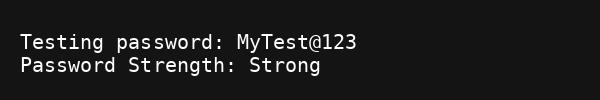

# 🛡️ Task 2: Password Strength Checker

This is Task 2 of my internship at **Brainwave Matrix Solutions**.  
The Python script checks the strength of a given password based on:

- Minimum length (8 characters)
- At least one lowercase letter
- At least one uppercase letter
- At least one number
- At least one special character

## 🚀 How to Run

```bash
python password_strength_checker.py
```

## 📸 Output Screenshot


